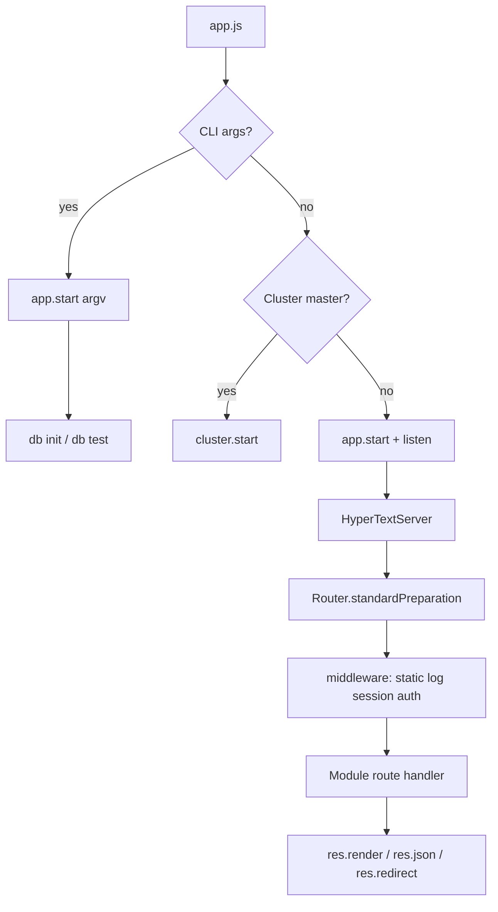

# Workflows index

Each workflow is a narrative of **what happens**, **which files own it**, and **what intention it teaches**.

| Workflow | Teaches | Doc |
|----------|---------|-----|
| Boot (CLI vs HTTP) | Cluster, `Application.start` / `listen`, CLI detection | [`workflows/boot.md`](./workflows/boot.md) |
| HTTP request | Preparer, middleware, modules, Mustache | [`workflows/http-request.md`](./workflows/http-request.md) |
| Admin auth | Session store, redirects, password verify | [`workflows/admin-auth.md`](./workflows/admin-auth.md) |
| Content CRUD | Module routes, `Model.save`, admin forms | [`workflows/content-crud.md`](./workflows/content-crud.md) |
| Database init | Schema create, model registry, seeding | [`workflows/db-init.md`](./workflows/db-init.md) |
| Testing | TestRunner, in-process server, MariaDB test DB | [`workflows/testing.md`](./workflows/testing.md) |

## Cross-cutting diagram

## Suggested reading path

1. Boot → understand how the process starts  
2. HTTP request → understand one page render  
3. Admin auth → understand session gate  
4. Content CRUD → understand write path  
5. DB init → understand schema ownership  
6. Testing → understand how we prove it
