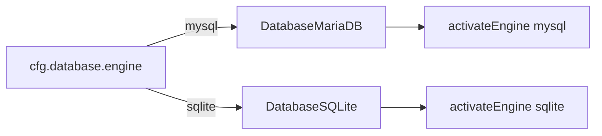

# Architecture: Connect engines

## Concept

Kado’s `Connect` pattern is: **managers hold named engines; engines share a small lifecycle**.

```js
app.database.addEngine('mysql', engine)
app.database.activateEngine('mysql')
// later, Application.start() → engine.start()
```

An engine is typically a subclass of `Connect.ConnectEngine` (or a domain base like `Database.DatabaseEngine`, `Email.EmailEngine`, `HyperText`’s server engine).

## Intention

Teach AIs to **extend engines** instead of inventing parallel service locators. This seed shows three engine stories:

| Engine | File | Lesson |
|--------|------|--------|
| MariaDB | `lib/DatabaseMariaDB.js` | Prefer stock `Database.MySQL`, but fix real gaps (here: `port` passed to `mysql2`) |
| SQLite | `lib/DatabaseSQLite.js` | Custom `DatabaseEngine` for opt-in small apps |
| Email | `lib/EmailConsole.js` | Custom `EmailEngine` that logs instead of SMTP |

## Rules of thumb

1. **Register once** during `App.register`, not inside request handlers.
2. **Activate** the DB engine you intend to use (`activateEngine`).
3. **No silent fallback** — if `engine === 'mysql'` and connect fails, crash; do not swap to SQLite.
4. **Match driver APIs** — `Query.execute(db)` expects something with `.execute` / `.query` (or a wrapper with `getEngine()`).

## MariaDB vs SQLite in this seed



SQLite also needs `SchemaSQLite` because stock `Schema.SQL` emits `ENGINE=InnoDB` which SQLite rejects.

## Related

- Data files: [`../files/lib-data.md`](../files/lib-data.md)
- DB init workflow: [`../workflows/db-init.md`](../workflows/db-init.md)
