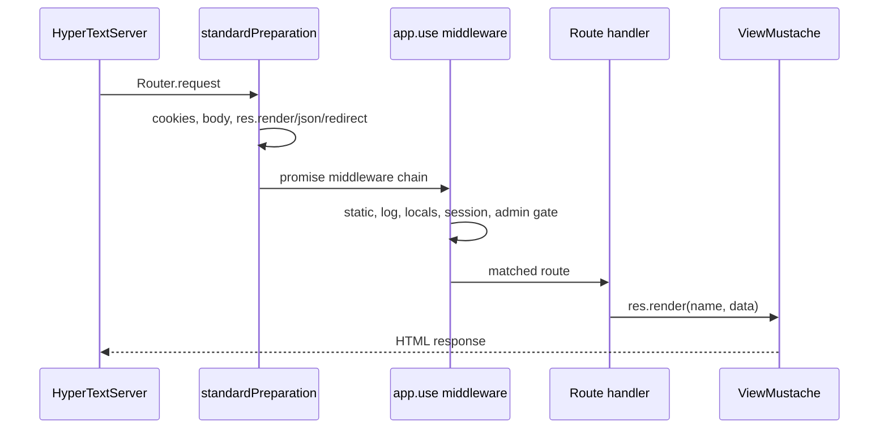

# Architecture: Request lifecycle

## Concept

One HTTP request flows through Kado like this:

## Stage 1 — Preparation

`Application.setup()` installs `Router.standardPreparation(app)`, which:

- Creates `req.locals`
- Parses cookies → `req.cookie`
- Parses query → `req.query`
- Parses body → `req.body` (`Parser.requestBody`)
- Attaches `res.render`, `res.json`, `res.redirect`, `res.sendFile`, `req.notify`

**Intention:** you do not manually parse JSON/urlencoded for normal form posts.

## Stage 2 — Middleware (promise-based)

Installed in [`lib/App.js`](../../lib/App.js):

1. Static files (`HyperText.StaticServer`)
2. Dev request logging
3. Template globals (`_appTitle`, `_appVersion`, …)
4. Session + admin auth gate

**Critical difference from Express:** there is no `next()`. Returning `true` (after `res.redirect` / `res.end`) stops the chain. Async middleware is awaited.

## Stage 3 — Route handler

Module methods:

- Set `req.locals._pageTitle`
- Load data via models
- `res.render('template', { ... })` or `res.json(...)` or `res.redirect(...)`

**Never** call `res.send(...)`.

## Stage 4 — View

Mustache templates under `view/`. Partials via `{{>header}}`. HTML fields use triple-stash `{{{content}}}` when content is trusted admin HTML (this seed trusts admin input — production apps must sanitize).

## Related

- Workflow: [`../workflows/http-request.md`](../workflows/http-request.md)
- Views: [`../files/views-and-public.md`](../files/views-and-public.md)
