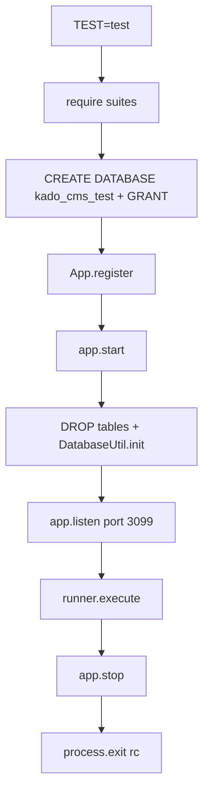

# Workflow: testing

## Command

```bash
npm test
# FOCUS=Page npm test
```

## What “good” looks like

- All suites green  
- Process exit code **0**  
- Against MariaDB database `kado_cms_test` (not `kado_cms`)

## Harness sequence



## Why HTTP integration tests

Kado apps are mostly middleware + routes + SQL. Mocking the router teaches little. Hitting real HTTP catches:

- Missing `.bind(this)`
- Wrong redirect status handling
- Session cookie issues
- Mustache path mistakes

## Writing a new test

1. Add `test/Feature.test.js` using `runner.suite` + `Assert`  
2. Append name to `suites` array in `test/index.js`  
3. Use `httpUtil.request(port, method, path, { headers, body })`  
4. For admin routes, login first and pass `Cookie` header  

## Session save after stop

You may see an “Unhandled rejection” from session save after the DB connection closes. Under `TEST=test`, `App.js` does not exit 211 on that. Exit code still reflects test results.

## Intention

Tests are part of the **teaching surface**. An AI that changes CRUD must update tests; an AI that adds Jest is wrong for this ecosystem.

## See also

- [`../files/test.md`](../files/test.md)
- [`../../KadoForAI.md`](../../KadoForAI.md) §9
